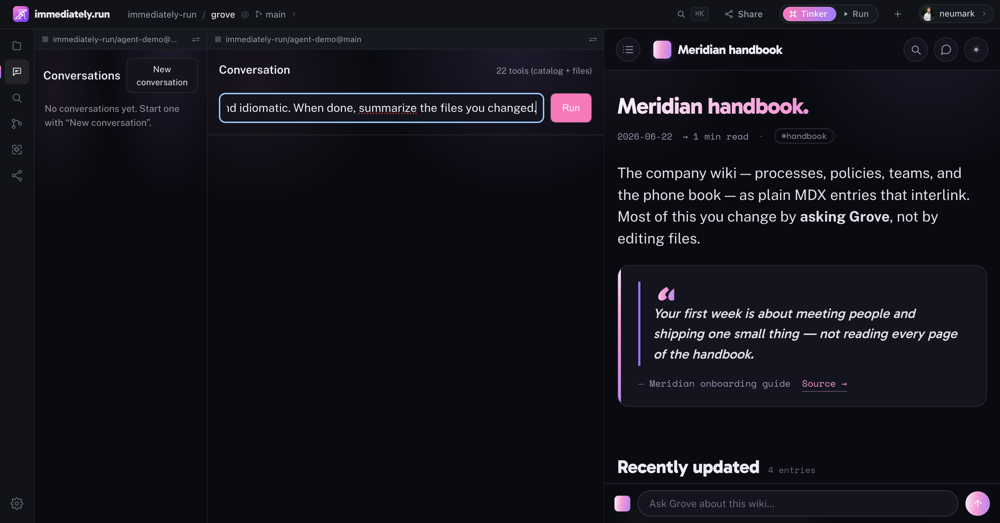
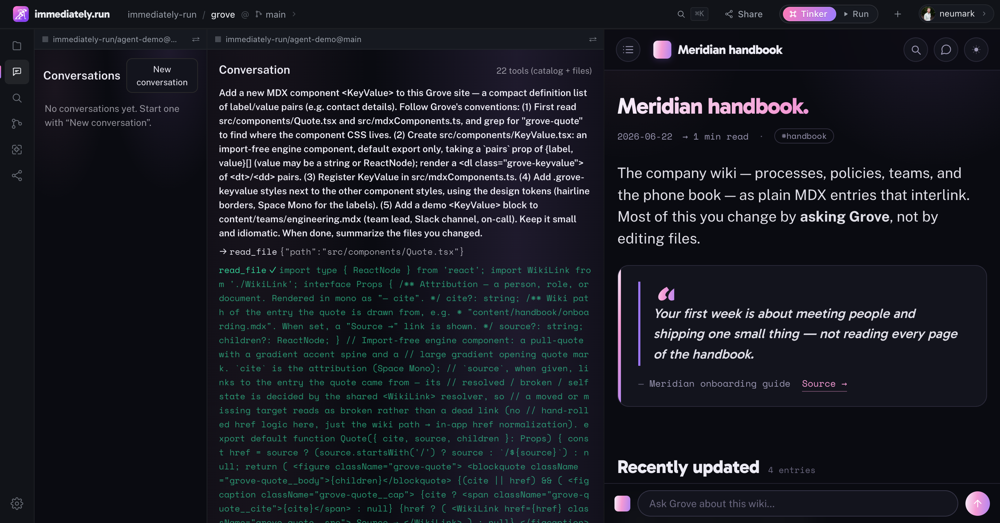
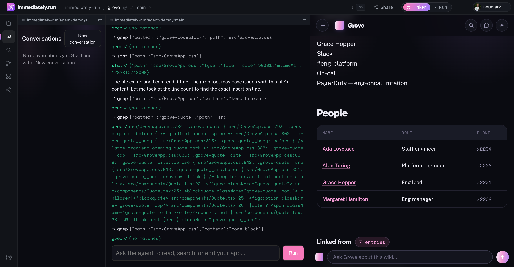

# Add a component to Grove with the coding agent.

A step-by-step walkthrough: build a real Grove MDX component — `<KeyValue>`, a
compact definition list for contact details and quick facts — by **asking the
in-browser coding agent**, not by typing the files yourself. Every step below is
taken from an actual end-to-end run; the screenshots are that run.

If you'd rather build the same kind of component **by hand**, see
[creating-a-component.md](./creating-a-component.md). For how the agent is wired
and its rough edges in general, see
[building-with-the-in-browser-agent.md](./building-with-the-in-browser-agent.md).

> **Honest summary up front.** The agent built, registered, and demoed a working
> `<KeyValue>` in one prompt — three files, correct on the first try. On the agent
> build used for this walkthrough it then **could not add the component's CSS** to
> Grove's large shared stylesheet, because its only write tool overwrote whole files.
> That split — *great at new files, stuck on big-file edits* — was the main lesson
> here. **It's since been fixed:** the agent gained an `edit_file` (string-replace)
> tool ([agent-demo #12](https://github.com/immediately-run/agent-demo/pull/12)) so it
> patches large files in place. The CSS step below is kept as the *pre-fix* account
> plus the by-hand workaround for any agent build that predates that tool.

## What you need

- A Grove site loaded on immediately.run (`local.immediately.run` for the local
  host, `immediately.run` for prod — never `localhost`).
- Signed in, with an **OpenRouter key stored** and a **model preference set** once
  (the agent runs on the host's `llm.chat` service; it never sees your key). If you
  haven't done this, do the one-time setup in
  [building-with-the-in-browser-agent.md](./building-with-the-in-browser-agent.md#2-set-the-provider-and-model-one-time).
  This run used `z-ai/glm-5.2`.
- A finger free for **Touch ID** — see step 4.

## Step 1 — Load Grove with a writable mount

Open Grove **from GitHub** (a local `immediately.run dev` mount is read-only, so the
agent can't edit it):

```
https://local.immediately.run/edit/github/immediately-run/grove/main/
```

This gives the agent a read-write, copy-on-write mount of Grove's working tree —
edits live in the browser until you publish them with Contribute.

## Step 2 — Open the Agents activity

Click **Agents** in the left activity rail. The main pane becomes the conversation;
its header reads "… tools (catalog + files)" — the agent's filesystem tools
(`read_file`, `write_file`, `list_dir`, `glob`, `grep`, `stat`, `delete_file`)
merged with Grove's capability catalog. Those file tools are scoped to **Grove's**
working tree, so the agent reads and writes the app you're looking at.

## Step 3 — Write the prompt

Give the agent the conventions up front so it doesn't have to guess — point it at
the same files a human would read first. The exact prompt used here:

> Add a new MDX component `<KeyValue>` to this Grove site — a compact definition
> list of label/value pairs (e.g. contact details). Follow Grove's conventions:
> (1) First read `src/components/Quote.tsx` and `src/mdxComponents.ts`, and grep for
> `"grove-quote"` to find where the component CSS lives. (2) Create
> `src/components/KeyValue.tsx`: an import-free engine component, default export
> only, taking a `pairs` prop of `{label, value}[]` (value may be a string or
> ReactNode); render a `<dl class="grove-keyvalue">` of `<dt>`/`<dd>` pairs.
> (3) Register `KeyValue` in `src/mdxComponents.ts`. (4) Add `.grove-keyvalue`
> styles next to the other component styles, using the design tokens (hairline
> borders, Space Mono for the labels). (5) Add a demo `<KeyValue>` block to
> `content/teams/engineering.mdx` (team lead, Slack channel, on-call). Keep it small
> and idiomatic. When done, summarize the files you changed.



A good prompt for an agent looks a lot like a good ticket: name the file paths,
name the conventions to match, and name a concrete demo so you can *see* the result.

## Step 4 — Run, and approve Touch ID

Click **Run**. The first model call raises a native **Touch ID / passkey** prompt
to unseal your provider key — approve it.

> **Heads-up (a real rough edge):** a build is a *loop* of model calls, and the
> unseal isn't cached across them, so you'll be prompted **several times** during one
> build (this run made five model calls and asked for Touch ID about three times).
> For a one-shot question it's a single tap; for an agent loop it's several. Keep a
> hand near the keyboard.

## Step 5 — Watch the tool loop

The agent works the plan with its tools: it reads `Quote.tsx` and
`src/mdxComponents.ts`, greps for `grove-quote` to locate the styles, reads the
target content file, then writes. In this run it created and wired everything on the
first pass:

- ✓ **wrote `src/components/KeyValue.tsx`** (the component, 1115 bytes)
- ✓ **wrote `src/mdxComponents.ts`** (registered `KeyValue` in the MDX map)
- ✓ **wrote `content/teams/engineering.mdx`** (the demo block)



The component it produced is clean, import-free, and idiomatic — no edits needed:

```tsx
import type { ReactNode } from 'react';

interface Pair {
  /** Label — rendered in Space Mono, uppercased. */
  label: string;
  /** Value — a plain string or arbitrary ReactNode (links, code, etc.). */
  value: ReactNode;
}

interface Props {
  /** Label/value pairs, rendered top-to-bottom as <dt>/<dd> rows. */
  pairs: Pair[];
}

// Import-free engine component: a compact definition list of label/value pairs…
export default function KeyValue({ pairs }: Props) {
  return (
    <dl className="grove-keyvalue">
      {pairs.map((p, i) => (
        <div className="grove-keyvalue__row" key={i}>
          <dt className="grove-keyvalue__label">{p.label}</dt>
          <dd className="grove-keyvalue__value">{p.value}</dd>
        </div>
      ))}
    </dl>
  );
}
```

And the demo it added to `content/teams/engineering.mdx`:

```mdx
## Contact

<KeyValue pairs={[
  { label: 'Team lead', value: 'Grace Hopper' },
  { label: 'Slack', value: '#eng-platform' },
  { label: 'On-call', value: 'PagerDuty — eng-oncall rotation' },
]} />
```

## Step 6 — See it render

Navigate Grove to the page you seeded the demo into (the **Engineering** entry). The
preview hot-reloads and `<KeyValue>` renders the rows — the component, registration,
and usage all work:



Notice two things in that screenshot. On the right, `<KeyValue>` renders the real
data (Grace Hopper, #eng-platform, the on-call rotation). On the left, the agent is
**still grepping `GroveApp.css`** — which brings us to the one thing it couldn't do.

## Step 7 — Where the agent stalls: the CSS

The prompt asked for `.grove-keyvalue` styles too. The agent **never wrote them.** It
read and grepped `src/GroveApp.css` twenty-plus times across two attempts, announced
"now I'll add the styles" repeatedly, and gave up each time — so `<KeyValue>` renders
**unstyled** (a plain stacked list, not the two-column hairline layout).

The cause isn't the model being lazy. Grove keeps all component styles in one
**~50 KB** `GroveApp.css`, and at the time of this run the agent's only writing tool,
`write_file`, **overwrote the whole file** — there was no patch / insert tool. To add
one rule, the agent would have to faithfully regenerate all 50,301 bytes, which it
won't (and shouldn't — a truncated rewrite would wipe every other component's styles).
So it looped looking for an "insertion point" the tool didn't offer.

> **Fixed.** The agent now has an **`edit_file`** tool
> ([agent-demo #12](https://github.com/immediately-run/agent-demo/pull/12)) that
> replaces an exact, unique snippet — a surgical edit, no whole-file rewrite. On a
> build with that tool, the agent adds the `.grove-keyvalue` rule itself (anchor on
> the line after `.grove-quote`, insert the new block). The walkthrough above is from
> a build *before* `edit_file` landed; if your agent still only offers `write_file`,
> use one of the workarounds below until the new tool is deployed.

**The rule of thumb still holds for *whole-file* rewrites:** the agent is excellent
at **creating new, small files** and now at **surgical `edit_file` changes**, but
**don't ask it to rewrite a large file wholesale.** Two ways to finish the styling on
a pre-`edit_file` build:

1. **Do the CSS by hand** in the platform editor — open `src/GroveApp.css`, drop the
   `.grove-keyvalue` block in after `.grove-quote`. (This is the path used to finish
   this run.)
2. **Keep component CSS small and local** so the agent *can* own it — e.g. a
   per-component `KeyValue.css` imported from `KeyValue.tsx`, instead of one giant
   shared stylesheet. A small new file plays to the agent's strength.

For reference, the styling to add — tokens from `src/index.css`, matching the rest
of the vocabulary:

```css
.grove-keyvalue { margin: 1.25rem 0; }
.grove-keyvalue__row {
  display: grid;
  grid-template-columns: minmax(8rem, 12rem) 1fr;
  gap: 1rem;
  padding: 0.55rem 0;
  border-bottom: 1px solid var(--border);
}
.grove-keyvalue__row:first-child { border-top: 1px solid var(--border); }
.grove-keyvalue__label {
  font-family: var(--mono);
  font-size: 0.78rem;
  letter-spacing: 0.04em;
  text-transform: uppercase;
  color: var(--ink-2);
}
.grove-keyvalue__value { color: var(--ink); }
```

## Step 8 — Review and publish

When the component looks right, **review the diff** and **Contribute** to open a PR —
the same flow as any other change. Read every hunk: the agent wrote real files in
your tree, so the PR review is your gate, not a formality.

## What to take away

- **Asking beats typing for new components.** One well-scoped prompt produced a
  correct, idiomatic `<KeyValue>` plus its registration and a working demo.
- **Give it the conventions.** Naming the files to read and the demo to add is what
  makes the output match Grove instead of generic React.
- **Big-file edits used to be the wall; `edit_file` fixes the common case.** With the
  string-replace tool ([agent-demo #12](https://github.com/immediately-run/agent-demo/pull/12))
  the agent patches large files in place. Still avoid asking it to *rewrite* a large
  file wholesale, and structuring styles into small per-component files never hurts.
- **You still review and publish.** The agent writes; Contribute + diff review is how
  the change actually ships.
